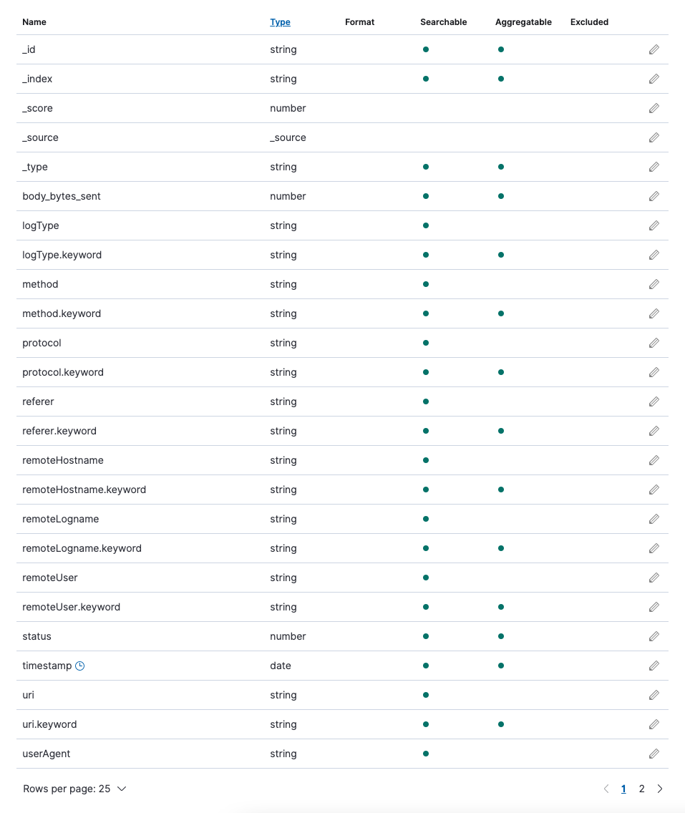

# Transform server access log into Amazon Elasticsearch Service

## Introduction
It is often to use server access log for troubleshooting and monitoring. In this lab, we will show how to 
1. [Create a delivery stream and stream data into Amazon Elasticsearch](#stage-1-create-a-delivery-stream-and-stream-data-into-amazon-elasticsearch)
2. [Use Amazon Data Firehose to transform the access log](#stage-2-use-amazon-data-firehose-to-transform-the-access-log)

## Architecture


## Prerequisites
You are required to have an Amazon Elasticsearch and a EC2 instance.

## Stage 1: Create a delivery stream and stream data into Amazon Elasticsearch

### Setup [Amazon Kinesis Data Firehose](https://aws.amazon.com/kinesis/data-firehose/)
Amazon Kinesis Data Firehose is the easiest way to reliably load streaming data into data lakes, data stores, and analytics services. It can capture, transform, and deliver streaming data to Amazon Elasticsearch Service. It is a fully managed service that automatically scales to match the throughput of your data and requires no ongoing administration. It can also batch, compress, transform, and encrypt your data streams before loading, minimizing the amount of storage used and increasing security.

1. In the AWS console, go to Kinesis and select [Delivery streams](https://console.aws.amazon.com/firehose/home)
2. Create delivery stream with below information
    * Step 1: Name and source
      * Delivery stream name: **access-log-stream-{any random number, I used 12345678 in the following lab}**
      * **Next**
    * Step 2: Process records
      * Data transformation: **Disabled**
      * Record format conversion: **Disabled**
      * **Next**
    * Step 3: Choose a destination
      * Destination: **Amazon Elasticsearch**
      * Domain: **Select the domain name as for the Amazon Elasticsearch**
      * Index: **access-log-12345678**
      * Index rotation: **Every day**
      * Destination VPC connectivity (you need to select the VPC if the Amazon Elasticsearch is in VPC. We are   using public endpoint for this lab)
      * Backup mode: **All records**
      * Backup S3 bucket: **Create new**
      * Backup S3 bucket: **delivery-stream-backup-access-log-12345678**
      * Region: the same region for Amazon Elasticsearch and Amazon Kinesis Data Firehose. We are using **US   East (N. Virginia)** in this lab
      * **Next**
    * Step 4: Configure settings
      * Buffer size: **1 MiB**
      * Buffer interval: **60 seconds**
      * S3 compression: **Disabled**
      * S3 encryption: **Disabled**
      * Error logging: **Enabled**
      * IAM role: **Create or update IAM role KinesisFirehoseServiceRole-access-log-st-us-east-1-xxxxxxxxxxxxx**
      * **Next**
    * Step 5: Review
      * **Create delivery stream**

### Test the result
In the [Kinesis Data Firehose delivery streams](https://console.aws.amazon.com/firehose/home), select the stream access-log-stream-12345678.
1. Select the **Test with demo data**
1. Click **Start sending demo data**
1. Go to Amazon Elasticsearch Kibana, select **Dev Tools** in the left navigation
1. Run `GET /_cat/indices/access-log-12345678-*?v&s=index` to see if the index has been created

> You cannot see any result becase there is a pemission missing. Follow below `Troubel shooting` steps.


### Trouble shooting 
1. Go to **Cloudwatch**
1. select **Log groups** with a name **/aws/kinesisfirehose/access-log-stream-12345678**
1. Search all event for last 30m. You should see error like this
```text
{
    "deliveryStreamARN": "arn:aws:firehose:us-east-1:123456789012:deliverystream/access-log-stream-12345678",
    "destination": "arn:aws:es:us-east-1:123456789012:domain/aes",
    "deliveryStreamVersionId": 1,
    "message": "Error received from Elasticsearch cluster. {\"error\":{\"root_cause\":[{\"type\":\"security_exception\",\"reason\":\"no permissions for [indices:data/write/bulk] and User [name=arn:aws:iam::123456789012:role/service-role/KinesisFirehoseServiceRole-access-log-st-us-east-1-xxxxxxxxxxxxx, backend_roles=[arn:aws:iam::123456789012:role/service-role/KinesisFirehoseServiceRole-access-log-st-us-east-1-xxxxxxxxxxxxx], requestedTenant=null]\"}],\"type\":\"security_exception\",\"reason\":\"no permissions for [indices:data/write/bulk] and User [name=arn:aws:iam::637412589734:role/service-role/KinesisFirehoseServiceRole-access-log-st-us-east-1-xxxxxxxxxxxxx, backend_roles=[arn:aws:iam::123456789012:role/service-role/KinesisFirehoseServiceRole-access-log-st-us-east-1-xxxxxxxxxxxxx], requestedTenant=null]\"},\"status\":403}",
    "errorCode": "ES.ServiceException"
}
```

Or 
1. Go to **S3** select the newly created bucket **delivery-stream-backup-access-log-12345678**
1. Select **elasticsearch-failed/** (it will show up if there is any error. The file path is yyyy/mm/dd)
1. Download the error log. You can see similar error.

> Key take away: Amazon Elasticsearch only allow authorized access. You need allow a role to send the data into Amazon Elasticsearch


### Setup access permission
1. In [Kinesis Data Firehose delivery streams](https://console.aws.amazon.com/firehose/home), select the devlivery **stream access-log-stream-12345678**
1. Click the **IAM role** in the Permissions session
1. Copy the Role ARN, like **arn:aws:iam::123456789012:role/service-role/KinesisFirehoseServiceRole-access-log-st-us-east-1-xxxxxxxxxxxxx**
1. Login into Amazon Elastisearch Kibana
1. Select in **Security** under **Management**
1. Select **all_access** in **Roles** 
1. Select **Manage mapping** in **Mapped users**
1. Add another backend role
1. Paste the copied role ARN into backend role, like arn:aws:iam::123456789012:role/service-role/KinesisFirehoseServiceRole-access-log-st-us-east-1-xxxxxxxxxxxxx
1. **Map**

> p.s. aware of the white space after the xxxxxxxxxxxxx if you are using copy and paste


### Verify the result
Go to **Amazon Elasticsearch Kibana Dev Tools** and execute `GET /_cat/indices/access-log-12345678*?v&s=index`

Expected result 


### Clean up the testing data
1. Stop sending demo data
1. In **Amazon Elasticsearch Kibana Dev Tools**, execute `Delete /access-log-12345678-*` to delete the demo data


## Stage 2: Use Amazon Data Firehose to transform the access log

### Setup an kinesis agent to stream the log into Kinesis Data Firehose
For installing the kinesis agent in EC2, please see [the documentation](https://docs.aws.amazon.com/firehose/latest/dev/writing-with-agents.html#download-install)

1. Update the kinesis agent configuration as below
```text
{
  "cloudwatch.emitMetrics": true,
  "kinesis.endpoint": "",
  "firehose.endpoint": "",
  "flows": [
    {
      "filePattern": "/tmp/access.log",
      "deliveryStream": "access-log-stream-12345678"
    }
  ]
}
```

1. Restart the kinesis agent
```shell
sudo service aws-kinesis-agent restart
```


### Create test case
1. SSH into the EC2 instance which installed the kinesis agent
1. Verify the kinesis agent is up and running `sudo service aws-kinesis-agent status`
1. Run below command to create the log generator script and allow to execute
```shell
cat <<EOF >/tmp/loggenerator.sh
#!/bin/bash
for number in {0..10000}
do
i=\$(wc -l < /tmp/access.log)
# Generate Random IP Address
IP_ADDRESS="\$(( \$RANDOM % 254 + 1 )).\$(( \$RANDOM % 254 + 1 )).\$(( \$RANDOM % 254 + 1 )).\$(( \$RANDOM % 254 + 1 ))"
# Get the current date/time
NOW=\$(date +"%d/%b/%Y:%H:%M:%S")
# Append a fake entry to the log file
echo "\$IP_ADDRESS - - [\$NOW +0000] \"GET / HTTP/2.0\" 200 \$i \"https://aws.amazon.com/\" \"Mozilla/5.0 (Windows NT 6.1) AppleWebKit/537.36 (KHTML, like Gecko) Chrome/72.0.3626.81 Safari/537.36\"" >> /tmp/access.log
wc -l /tmp/access.log
done
exit 0
EOF
sudo chmod 755 /tmp/loggenerator.sh
```

1. Generate some access log
```shell
/tmp/loggenerator.sh
```

1. Go to Amazon Elasticsearch Kibana, select **Stack Management** in the left navigation
1. Go to **Index Patterns** and **Create index pattern**
1. In Index pattern name type **access-log-12345678\***
1. **Next step**
1. **Create index pattern**

> Error: You cannot see anything in Amazon Elasticsearch. Let's check the error message.


### Trouble shooting
1. Go to **Cloudwatch**
1. select **Log groups** with a name **/aws/kinesisfirehose/access-log-stream-12345678**
1. Search all event for last 30m. You should see error like this
```text
{
    "deliveryStreamARN": "arn:aws:firehose:us-east-1:637412589734:deliverystream/access-log-stream-12345678",
    "destination": "arn:aws:es:us-east-1:637412589734:domain/aes",
    "deliveryStreamVersionId": 2,
    "message": "{\"type\":\"mapper_parsing_exception\",\"reason\":\"failed to parse\",\"caused_by\":{\"type\":\"not_x_content_exception\",\"reason\":\"not_x_content_exception: Compressor detection can only be called on some xcontent bytes or compressed xcontent bytes\"}}",
    "errorCode": "400"
}
```

Or 
1. Go to **S3** select the newly created bucket **delivery-stream-backup-access-log-12345678**
1. Select **elasticsearch-failed/** (it will show up if there is any error. The file path is yyyy/mm/dd)
1. You can see similar error in the download file.

> Take away: Don't get frustrated when there is something wrong. Leverage Cloudwatch and S3 elasticsearch-failed for troubleshooting


### Setup Lambda function for transform
1. Go to Lambda
1. Create function
1. Select **Author from scratch**
    * Function name: access-log-12345678-log-converter
    * Runtime: Node.js 14.x
    * **Create function**
1. Configure the lambda function
    * Copy and paste below code into lambfa
```text
const months = ["0","jan", "feb", "mar", "apr", "may", "jun", "jul", "aug", "sep", "oct", "nov", "dec"];
const access_log_parser = /^(?<remoteHostname>\d{1,3}\.\d{1,3}\.\d{1,3}\.\d{1,3})\s(?<remoteLogname>(?:\-|\w+))\s(?<remoteUser>(?:\-|\w+))\s+\[(?<timestamp_date>\d{2})\/(?<timestamp_month>[A-Za-z]{3})\/(?<timestamp_year>\d{4}):(?<timestamp_time>\d{2}:\d{2}:\d{2}) (?<timezoneOffset_hour>(?:\+|\-)\d{2})(?<timezoneOffset_minutes>\d{2})\]\s"(?<method>(?:CONNECT|DELETE|GET|HEAD|OPTIONS|POST|PUT|TRACE))\s(?<uri>.+?)\s(?<protocol>HTTP\S\d\S\d)"\s(?<status>\d{3})\s(?<body_bytes_sent>\d+)\s"(?<referer>[\S]*)"\s"(?<userAgent>.+?)(?:\"\s\"(?<xForwardedFor>(?:\-|\S+)))?\"$/m;
exports.handler = async (event, context) => {
    let success = 0; // Number of valid entries found
    let failure = 0; // Number of invalid entries found
    /* Process the list of records and transform them */
    const output = event.records.map((record) => {
        // Kinesis data is base64 encoded so decode here
        const payload = (Buffer.from(record.data, 'base64')).toString('ascii');
        const access_log_match = payload.match(access_log_parser);
        if (access_log_match) {
            //Process the date format to Elasticsearch supported format
            const MM = (months.indexOf(access_log_match.groups.timestamp_month.toLowerCase())<10) ? '0'+months.indexOf(access_log_match.groups.timestamp_month.toLowerCase()): months.indexOf(access_log_match.groups.timestamp_month.toLowerCase());
            const dd = (access_log_match.groups.timestamp_date<10) ? '0'+access_log_match.groups.timestamp_date: access_log_match.groups.timestamp_date;
            const timestamp = access_log_match.groups.timestamp_year+'-'+MM+'-'+dd+'T'+access_log_match.groups.timestamp_time+access_log_match.groups.timezoneOffset_hour+':'+access_log_match.groups.timezoneOffset_minutes;
            //Convert the result into json format
            const result = {
                logType: 'apache combined log',
                remoteHostname: access_log_match.groups.remoteHostname,
                remoteLogname: access_log_match.groups.remoteLogname,
                remoteUser: access_log_match.groups.remoteUser,
                timestamp: timestamp,
                method: access_log_match.groups.method,
                uri: access_log_match.groups.uri,
                protocol: access_log_match.groups.protocol,
                status: parseInt(access_log_match.groups.status),
                body_bytes_sent: parseInt(access_log_match.groups.body_bytes_sent),
                referer: access_log_match.groups.referer,
                userAgent: access_log_match.groups.userAgent,
            }
            success++;
            return {
                recordId: record.recordId,
                result: 'Ok',
                data: (Buffer.from(JSON.stringify(result))).toString('base64'),
            };
        }
         else {
            /* Failed event, notify the error and leave the record intact */
            failure++;
            return {
                recordId: record.recordId,
                result: 'ProcessingFailed',
                data: record.data,
            };
        }
    });
    console.log(`Processing completed.  Successful records ${success}, Failed records ${failure}.`);
    return { records: output };
};
```

    * Click **Deploy**
    * Go to **Configuration**
    * Edit the General configuration
      * Memory: 512 MB
      * Timeout: 1 min
      * **Save**
1. Create a test case
    * Go to **Test** in the same lambda function
    * Create a new text event
      * Name: accesslog12345678
      * content
```text
{
  "invocationId": "111aaaaa-aaa1-1a1a-11a1-11a1a111a111",
  "deliveryStreamArn": "arn:aws:firehose:us-east-1:123456789012:deliverystream/log-converter",
  "region": "us-east-1",
  "records": [
    {
      "data": "MjM1LjI0MS4xNDYuMTY3IC0gLSBbMTUvQXVnLzIwMjE6MDg6MDM6MTkgKzAwMDBdICJHRVQgLyBIVFRQLzIuMCIgMjAwIDM5OTk0ICJodHRwczovL2F3cy5hbWF6b24uY29tLyIgIk1vemlsbGEvNS4wIChXaW5kb3dzIE5UIDYuMSkgQXBwbGVXZWJLaXQvNTM3LjM2IChLSFRNTCwgbGlrZSBHZWNrbykgQ2hyb21lLzcyLjAuMzYyNi44MSBTYWZhcmkvNTM3LjM2Ig==",
      "recordId": "12345678901212345678901212345678901212345678901212345678901211",
      "approximateArrivalTimestamp": 1626874159781
    },
    {
      "data": "MjM2LjIzOS4xNzYuNzkgLSAtIFsxNS9BdWcvMjAyMTowODowMzoxOSArMDAwMF0gIkdFVCAvIEhUVFAvMi4wIiAyMDAgMzk5OTUgImh0dHBzOi8vYXdzLmFtYXpvbi5jb20vIiAiTW96aWxsYS81LjAgKFdpbmRvd3MgTlQgNi4xKSBBcHBsZVdlYktpdC81MzcuMzYgKEtIVE1MLCBsaWtlIEdlY2tvKSBDaHJvbWUvNzIuMC4zNjI2LjgxIFNhZmFyaS81MzcuMzYi",
      "recordId": "12345678901212345678901212345678901212345678901212345678901212",
      "approximateArrivalTimestamp": 1626874159781
    }
  ]
}
```

      * **Save changes**
    * Click **Test**. You should able to see `Execution result: succeeded`


### Update the delivery stream 
1. Go to [Kinesis Data Firehose delivery streams](https://console.aws.amazon.com/firehose/home), select the devlivery **stream access-log-stream-12345678**
1. Click **Edit**
1. Select `Enabled` in **Source record transformation**
    * Lambda function: **access-log-12345678-log-converter**
    * Buffer size: **1** MiB
    * Buffer interval: **60** seconds
    * **Save**
1. Go to **Amazon Elasticsearch Kibana Dev Tools** and execute `Delete /access-log-12345678*` to delete the existing configuration
1. In the **EC2** instance, run `/tmp/loggenerator.sh` to generate new log.
1. Wait for 1 min
1. Go to **Amazon Elasticsearch Kibana Dev Tools** and execute `GET /_cat/indices/access-log-12345678*?v&s=index`. Expected result
```text
health status index                          uuid                   pri rep docs.count docs.deleted store.size pri.store.size
green  open   access-log-12345678-2021-08-15 U5kd3tzRScuE4ELNHH_jXA   5   1       5200            0      1.3mb        708.2kb
```
1. Go to **Amazon Elasticsearch Kibana Stack Management**
1. Select **access-log-12345678\*** and remove index pattern by clicking the trash icon in right top corner
1. **Delete**
1. **Create index pattern** with index pattern name type **access-log-12345678\***
1. **Next step**
1. Select `timestamp` under **Time field**
1. **Create index pattern** 



1. Go To Amazon Elasticsearch Kibana, select **Discover** in the left navigation
1. Select **access-log-12345678\*** in the index pattern


> Take away: By rewriting the `access_log_parser` in the code, you can transform your data into an Amazon Elasticsearch readable format. The `access_log_parser` is supported [Apache](http://httpd.apache.org/docs/current/logs.html#combined) and Nginx access log.


Follow up reading:
* [Amazon Elasticsearch Service Intro Workshop](https://github.com/aws-samples/amazon-elasticsearch-intro-workshop)
* [Amazon Elasticsearch Service Monitor](https://github.com/aws-samples/amazon-elasticsearch-service-monitor)
* [SIEM on Amazon Elasticsearch Service](https://github.com/aws-samples/siem-on-amazon-elasticsearch-service)


